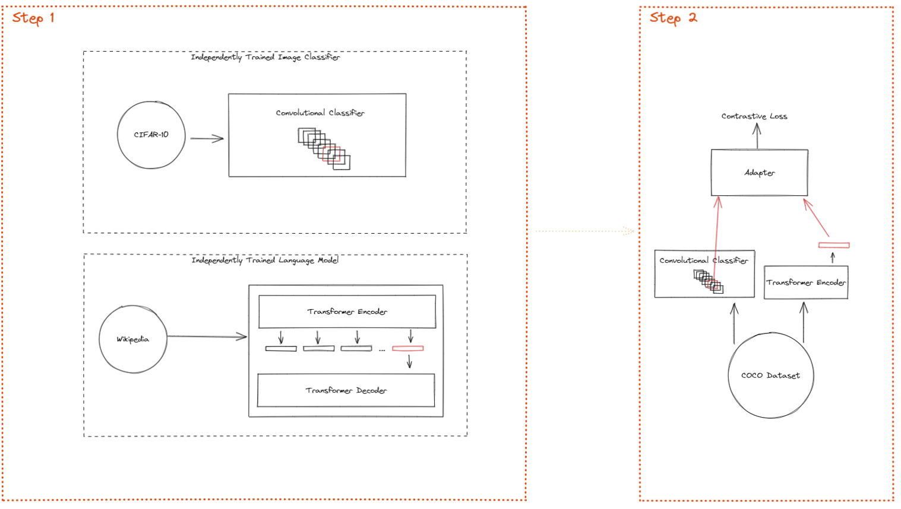

# Explaining Neural Network Operations with CLIP/Annotation Models

## Abstract

We discuss:

1. Using language models to yield interpretations of convolutional filters in convolutional neural networks.
2. Using language models to consolidate the meaning of batches of convolutional filters.
3. Guiding convolutional neural networks to be sensitive to different effects using the language models.

## Introduction

In this repository we play with coupling language models to arbitrary neural nets. 

As a first step, we restrict ourselves to convolutional networks, as there has been many efforts to explain convnet classifiers in an image setting. Typical techniques involve either measuring the sensitivity of classification to pixel-level changes, or sometimes the convolutional filters themselves have been studied by optimizing images to maximally excite those filters \[Olah [1](https://ai.googleblog.com/2015/06/inceptionism-going-deeper-into-neural.html), [2](https://distill.pub/2017/feature-visualization/)\] \[[Lee](http://web.eecs.umich.edu/~honglak/icml09-ConvolutionalDeepBeliefNetworks.pdf)]. However, no work yet exists which attempts to explaining the purpose of each convolutional filter using a coupled language model. We aim to focus first on the latter problem of explainability at the filter/channel level, though we can also consider explainability of the entire model or subsets of the model using similar techniques **🧐 perhaps this can be used to study lottery ticket hypothesis. 🧐**

As a tentative definition, open to discussion

 > Given two models $A$ and $B$ which have input spaces $V_A$ and $V_B$ respectively together with a dataset that contains pairs $(v_A, v_B) \vert v_a \in V_A, v_b \in V_B$. The models are called coupled if some portion of the internal representation of any $v_a$ in $A$ is identical, or mappable under a fixed and known differentiable function $f$, to some corresponding portion of the internal representation of $v_b$ in $B$.
 
In a typical setup, an encoder-decoder style LM could be trained on an independent text corpus, and an image classification model on a similarly independent set of images. Finally, an adaptor layer, perhaps a matrix, could learn a mapping from, for instance, a special encoder token distinguished to carry the sentence context during training, to the output of a convolutional filter in the image classifier using a third coupling dataset. This is represented in the figure below.

If a language model can successfully couple with a convnet filter, it can be used to explain the meaning of the filter in plain-text English by finding sentences which maximally excite the filter. This would be a novel technique in its own right, but more excitingly, it could be extended to other types of models where the input data is not as easily interpretable as a single image (for instance a sequence model which supports inputs from different modalities such as text, images, and panel data). The convolutional filter is a natural target to attack first as there is prior art to help verify the technique's utility, however, coupling to a single convolutional channel should not necessarily be any more difficult than coupling to a set of attention heads or larger swaths of the network.

In addition, a coupled language model creates an opportunity to guide internal knowledge of a system. At the filter level, building filters sensitive to certain concepts would be easy by simply requiring the mapped embedding to be maximally excited by a sentence explaining the object. In other words, require that some filters respond strongly to the mapped sentence.

More generally, we can impart semantic knowledge into the classifier using plain English. For instance, suppose the classifier is often confusing reindeer and dogs. We know that reindeer always have antlers, we can teach this knowledge to the image classifier by minimizing the response of the reindeer class to the sentence "a reindeer without antlers".  **🧐 I'm sure there's a cleaner way to do this? 🧐** 

## Types of Couplings
Several out of the box networks already exist with coupled representations of language-image pairs. A popular example is openAIs CLIP, but generally image captioning models normally have some version of this **🧐 is this true? 🧐**.

### Adaptor layers

The most basic building block of this design is the use of an adapter layer between the latent reps of the language model and some portion of convnet. The adapter layer is a transformation which takes the latent representation of the language model and maps it into the convnet. Though there is likely a more ideal architecture, we start by using an adaptor layer which is simply an $N \times M$ matrix, where $N$ is the dimension of the text representation in the language model and $M$ is the portion of the convolutional model we are coupling.

## Resources
[COCO dataset](https://cocodataset.org/#home) 